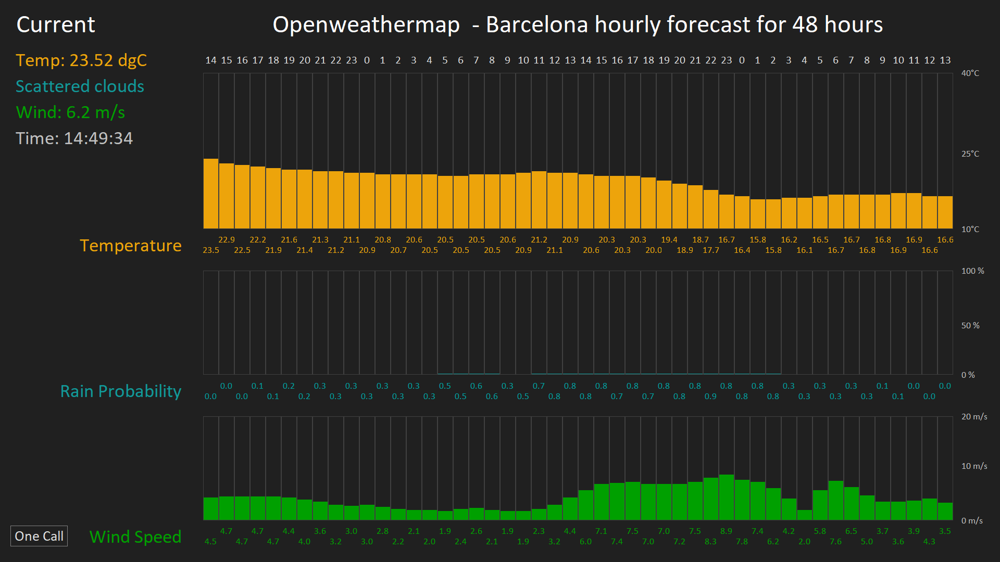

# medialon_script-openweathermap

OpenWeatherMap provides historical, current and forecasted weather data. With the One Call API, the essential weather data for a specific location is free under 1000 calls/day ( max a call every 2 minutes, good enought for weather data I think )

I've upload also the manager file, v6.7.2, I've programmed for a 48 hourly prevision for rain, wind speed and temperatura. 
Thinking in an open air installation could be very handy

Sign in to get an Api key and with your latitud and longitud configure the script.

#####   
##### Medialon Manager Panel screenshot:

